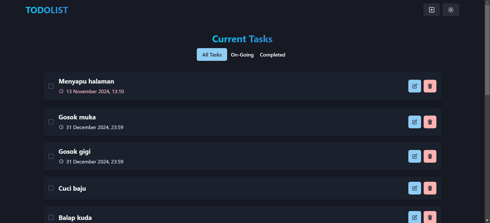
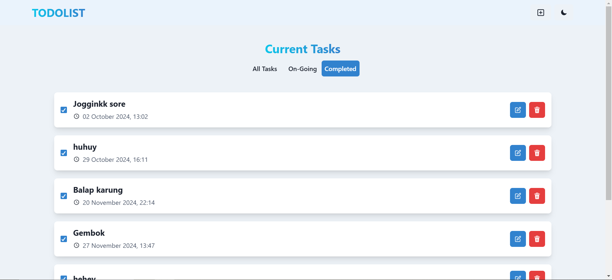
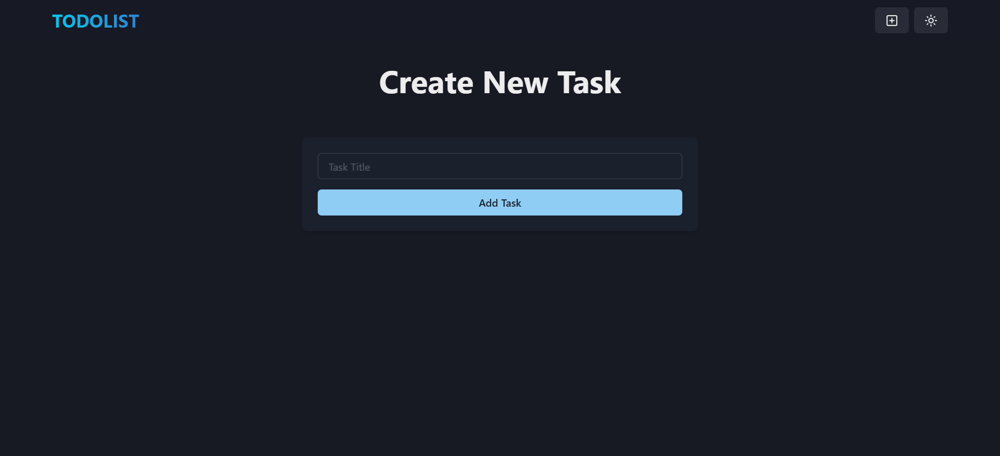

# Todolist Front-End

## Overview

The **Todolist Front-End** is the user interface for managing tasks through a modern, responsive web application. It utilizes React with Chakra UI for a seamless user experience and integrates with the Todolist API for backend services. This application currently supports the **core features** and part of the **additional features** related to task deadlines.

## Screenshots







## Features

### Core Features:
1. Add a task.
2. View ongoing task(s).
3. Delete a task.
4. Update/Edit a task.
5. Mark a task as complete.

### Additional Features:
1. Add a deadline to a task (date and time).
2. Show an indicator if a task is overdue.

## Tech Stack

- **React**: Library for building the user interface.
- **Chakra UI**: Component library for accessible and responsive design.
- **Zustand**: State management library.
- **React Router DOM**: For routing and navigation.
- **Vite**: Build tool for development and production.
- **React Hot Toast**: For user notifications.
- **Date-FNS**: Utility library for date handling.

## Installation and Setup

1. Clone the repository:
   ```bash
   git clone https://github.com/your-repo/todolist-fe.git
   cd todolist-fe
   ```

2. Install dependencies:
   ```bash
   npm install
   ```

3. Start the development server:
   ```bash
   npm run dev
   ```

4. Build the application for production:
   ```bash
   npm run build
   ```

5. Preview the production build:
   ```bash
   npm run preview
   ```